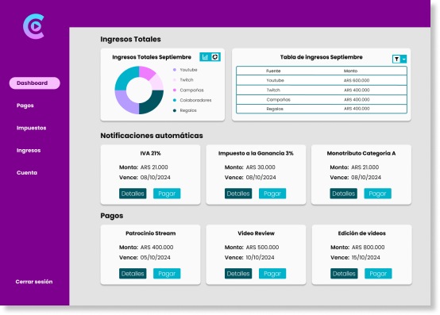

# YouCreate


Simulacion de MVP, Fintech diseñada para administrar las finanzas de creadores de contenido. Implementa **Material Design**, **Bootstrap**, internacionalización (i18n) y **gráficas interactivas**.


## 📑 Tabla de Contenidos
- [Introducción](#introducción)  
- [Características](#características)  
- [Requisitos Previos](#requisitos-previos)  
- [Instalación](#instalación)  
- [Uso](#uso)  
- [Scripts Disponibles](#scripts-disponibles)  
- [Estructura del Proyecto](#estructura-del-proyecto)  
- [Configuración](#configuración)  
- [Dependencias Principales](#dependencias-principales)  
- [Contribución](#contribución)  
- [Licencia](#licencia)  

---

## 🚀 Introducción
**YouCreate** es una aplicación Angular (v18) pensada como base escalable para proyectos web.  
Incluye soporte para **SSR (Server-Side Rendering)**, internacionalización, temas personalizados y visualización de datos con librerías como **ApexCharts** y **Chart.js**.

---

## ✨ Características
- ⚡ Construida con **Angular 18**.  
- 🎨 Integración con **Angular Material** y **Bootstrap 5**.  
- 🌍 Internacionalización (soporte para `es` y `en-US`).  
- 📊 Gráficas con **Chart.js**, **ng2-charts** y **ng-apexcharts**.  
- 🔑 Manejo de autenticación con **jwt-decode**.  
- 📦 Estructura lista para producción con configuración de entornos (`development` y `production`).  
- 🚀 Compatible con **SSR (Server-Side Rendering)** mediante Express.  

---

## 🛠 Requisitos Previos
- [Node.js](https://nodejs.org/) >= 18  
- [Angular CLI](https://angular.io/cli) >= 18  

---

## 📥 Instalación
```bash
# Clonar el repositorio
git clone <URL_DEL_REPO>

# Entrar al directorio
cd youcreate

# Instalar dependencias
npm install
```

---

## ▶️ Uso
```bash
# Ejecutar en modo desarrollo
npm start

# Compilar para producción
npm run build

# Ejecutar pruebas
npm test
```

---

## 📜 Scripts Disponibles
Desde el archivo `package.json`:  
- `npm start` → Inicia la aplicación en modo desarrollo (`ng serve`).  
- `npm run build` → Compila la app en modo producción.  
- `npm run watch` → Compilación en modo desarrollo con watch activo.  
- `npm test` → Ejecuta pruebas con Karma.  
- `npm run serve:ssr:template-angular-ts` → Sirve la aplicación renderizada en servidor (SSR).  

---

## 📂 Estructura del Proyecto
```
src/
 ├── app/               # Componentes principales
 ├── assets/            # Recursos estáticos
 ├── environments/      # Configuración de entornos
 ├── index.html         # Archivo raíz HTML
 ├── main.ts            # Punto de entrada
 ├── styles.css         # Estilos globales
 └── custom-theme.scss  # Tema personalizado
```

---

## ⚙️ Configuración
- **Entornos:**  
  - `src/environments/environment.ts` → Desarrollo  
  - `src/environments/environment.prod.ts` → Producción  
- **Internacionalización (i18n):**  
  - Idioma por defecto: **es**  
  - Traducciones adicionales: **en-US** (`src/locale/messages/en-US.xlf`)  

---

## 📦 Dependencias Principales
Algunas dependencias clave:  
- **Angular**: `@angular/core`, `@angular/router`, `@angular/forms`  
- **Material Design**: `@angular/material`, `@angular/cdk`  
- **Bootstrap 5**: `bootstrap`  
- **Gráficas**: `chart.js`, `ng2-charts`, `apexcharts`, `ng-apexcharts`  
- **Internacionalización**: `@ngx-translate/core`, `@ngx-translate/http-loader`, `@angular/localize`  
- **SSR y servidor**: `@angular/ssr`, `express`  
- **Autenticación**: `jwt-decode`  

---

## 🤝 Contribución
1. Haz un fork del repositorio  
2. Crea una rama (`git checkout -b feature/nueva-funcionalidad`)  
3. Realiza tus cambios y haz commit (`git commit -m 'Agrega nueva funcionalidad'`)  
4. Sube tu rama (`git push origin feature/nueva-funcionalidad`)  
5. Abre un Pull Request  

---

## 📄 Licencia
Este proyecto se distribuye bajo la licencia **MIT**.  
